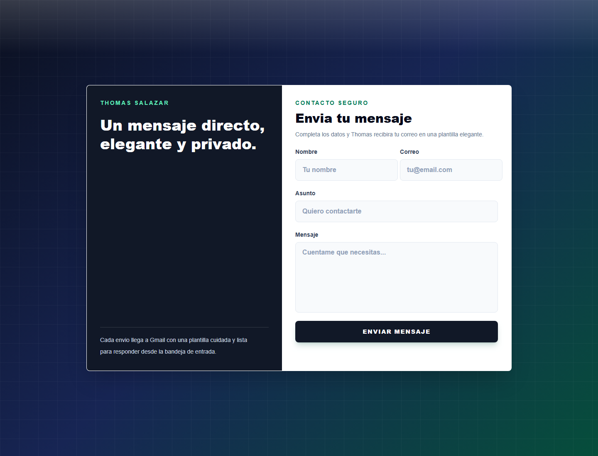

# Send Me An Email

Aplicacion web construida con Next.js para enviar mensajes desde un formulario directamente a Gmail. El correo se envia con Nodemailer y llega con una plantilla HTML personalizada para Thomas Salazar.



## Caracteristicas

- Formulario responsive con UI tipo login premium.
- Envio de correos usando Gmail y Nodemailer.
- Plantilla HTML elegante para los mensajes recibidos.
- Validacion basica de nombre, correo, asunto y mensaje.
- Campo `replyTo` configurado con el correo del visitante para responder facilmente.
- Lista para desplegar en Vercel usando variables de entorno.

## Tecnologias

- Next.js 16
- React 19
- TypeScript
- Tailwind CSS
- Nodemailer
- Gmail SMTP

## Variables de entorno

Crea un archivo `.env.local` en la raiz del proyecto:

```env
EMAIL_USER=tu_correo@gmail.com
EMAIL_PASS=tu_app_password_de_gmail
EMAIL_TO=correo_destino@gmail.com
```

Notas importantes:

- `EMAIL_USER` es el Gmail que enviara los mensajes.
- `EMAIL_PASS` debe ser una contrasena de aplicacion de Google, no la contrasena normal de Gmail.
- `EMAIL_TO` es el correo que recibira todos los mensajes del formulario.
- Si cambias `.env.local`, reinicia el servidor de desarrollo.

## Instalacion

```bash
npm install
```

## Desarrollo

```bash
npm run dev
```

Abre `http://localhost:3000` en el navegador.

## Build de produccion

```bash
npm run build
npm run start
```

## Despliegue en Vercel

1. Sube el proyecto a GitHub.
2. Importa el repositorio en Vercel.
3. Agrega las variables `EMAIL_USER`, `EMAIL_PASS` y `EMAIL_TO` en Project Settings > Environment Variables.
4. Despliega la aplicacion.

## Como funciona

El visitante completa el formulario. La app envia esos datos al endpoint `/api/email`, donde se valida la informacion y se manda el correo usando la cuenta configurada en `EMAIL_USER`. El destinatario final es `EMAIL_TO`.

## Autor

Thomas Salazar
